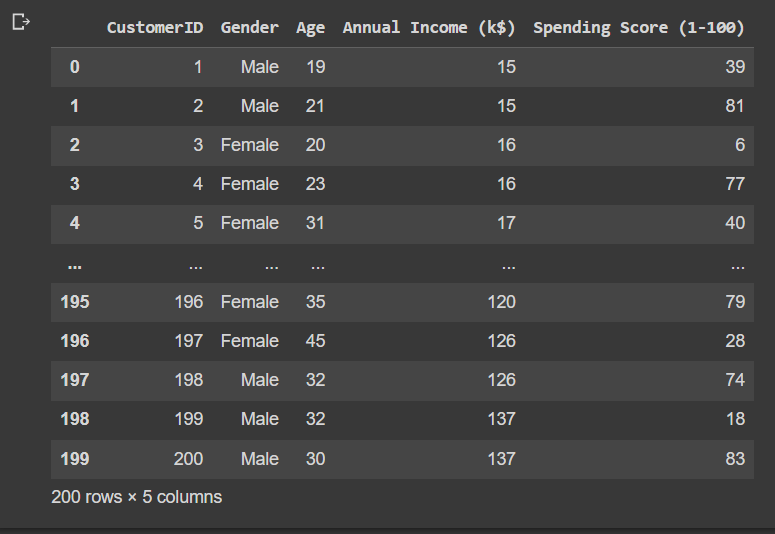
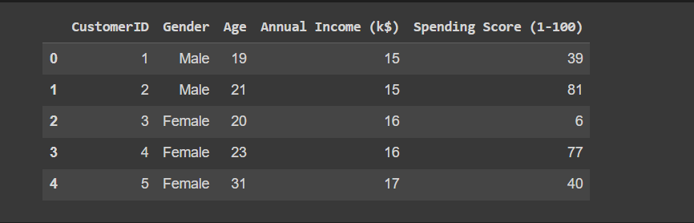
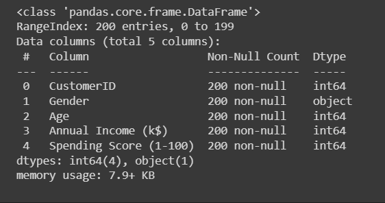
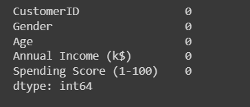
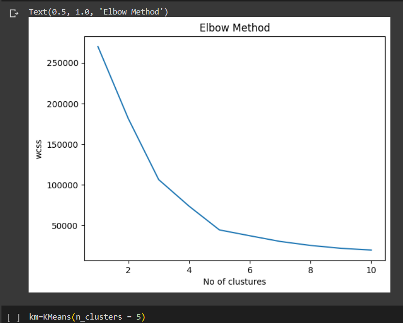
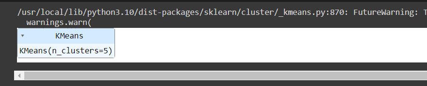
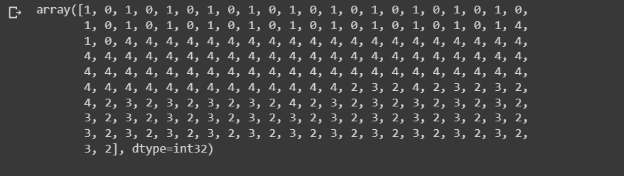
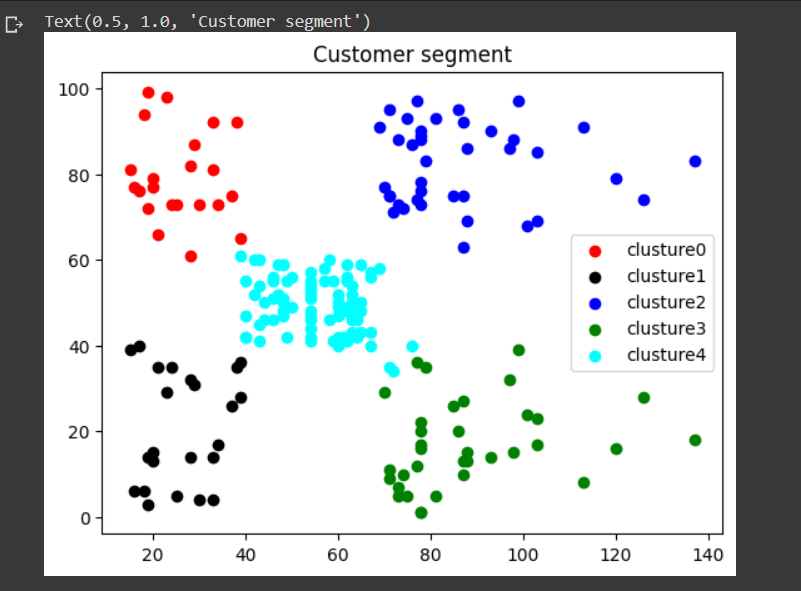

# Implementation-of-K-Means-Clustering-for-Customer-Segmentation

## AIM:
To write a program to implement the K Means Clustering for Customer Segmentation.

## Equipments Required:
1. Hardware – PCs
2. Anaconda – Python 3.7 Installation / Jupyter notebook

## Algorithm
1. Import the required libraries.
2. Upload the dataset in the compiler and read the dataset.
3. Find head,info and null elements in the dataset.
4. Using LabelEncoder and DecisionTreeRegressor , find MSE and R2 of the dataset.
5. Predict the values and end the program.

## Program:
```
/*
Program to implement the K Means Clustering for Customer Segmentation.
Developed by: MADHAN BABU P
RegisterNumber:  212222230075
*/
import numpy as np
import matplotlib.pyplot as plt
from scipy import optimize
df = pd.read_csv('/content/Mall_Customers.csv')
df

df.head()

df.info()

df.isnull().sum()

from sklearn.cluster import KMeans
wcss = []

for i in range(1,11):
   kmeans = KMeans(n_clusters = i,init = "k-means++")
   kmeans.fit(df.iloc[:,3:])
   wcss.append(kmeans.inertia_)

import matplotlib.pyplot as plt
plt.plot(range(1,11),wcss)
plt.xlabel("No of clustures")
plt.ylabel("wcss")
plt.title("Elbow Method")

km=KMeans(n_clusters = 5)
km.fit(df.iloc[:,3:])

y_pred=km.predict(df.iloc[:,3:])
y_pred

df["clusture"]=y_pred
df0=df[df["clusture"]==0]
df1=df[df["clusture"]==1]
df2=df[df["clusture"]==2]
df3=df[df["clusture"]==3]
df4=df[df["clusture"]==4]
plt.scatter(df0["Annual Income (k$)"],df0["Spending Score (1-100)"],c="red",label="clusture0")
plt.scatter(df1["Annual Income (k$)"],df1["Spending Score (1-100)"],c="black",label="clusture1")
plt.scatter(df2["Annual Income (k$)"],df2["Spending Score (1-100)"],c="blue",label="clusture2")
plt.scatter(df3["Annual Income (k$)"],df3["Spending Score (1-100)"],c="green",label="clusture3")
plt.scatter(df4["Annual Income (k$)"],df4["Spending Score (1-100)"],c="cyan",label="clusture4")
plt.legend()
plt.title("Customer segment")


```

## Output:
## mall customer data set

## df.head() value

## df.info() value

## df.isnull().sum() value

## Wcss graph

## kmean value

## y pred array value

## customer segment clusture



## Result:
Thus the program to implement the K Means Clustering for Customer Segmentation is written and verified using python programming.
